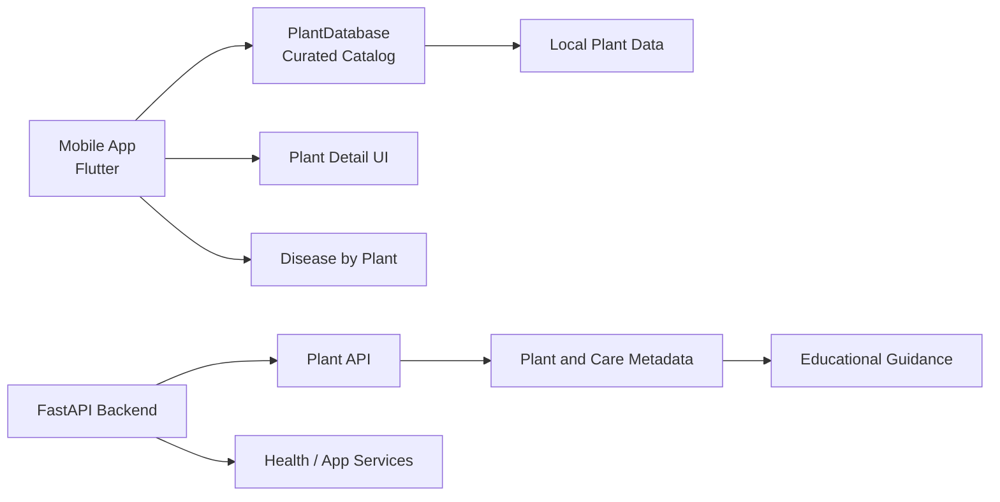
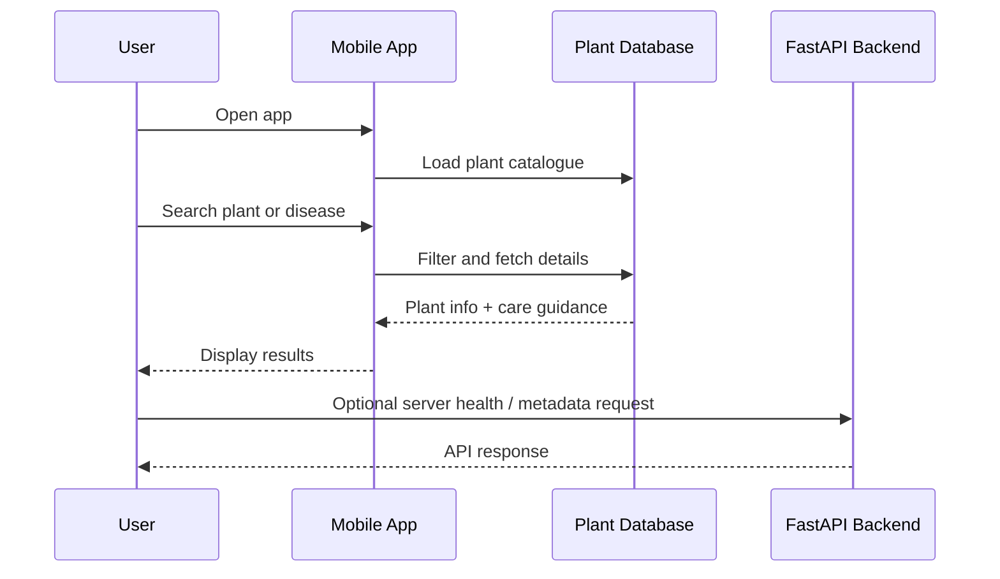

# PlantDoctor

<div align="center">
  
</div>

<p align="center">
  <strong>Plant health intelligence for curious growers</strong><br />
  A simple, reliable plant-information platform built with Flutter and FastAPI.
</p>

<p align="center">
  
  
  
  
</p>

## Overview

PlantDoctor is a plant-learning and care-support project designed to help people:

- browse a curated plant catalog
- understand plant care and disease patterns
- explore local plant health guidance safely
- keep the project simple, offline-friendly, and easy to extend

This repository contains a compact monorepo with:

- a Flutter mobile app for Android
- a FastAPI backend for app services and API endpoints
- plant data models and curated reference content
- a clear, educational approach that avoids unsafe treatment claims

> PlantDoctor is an educational plant-information tool, not a prescription medical system or a complete global botanical database.

---

## Key Features

- Plant browser with search and categories
- Plant detail cards with care summaries
- Disease-by-plant lookup and education-focused guidance
- Local, offline-first plant reference content
- API-ready backend structure for expansion
- Clean separation between app UI, services, and data

---

## Architecture



### System block diagram

```mermaid
block-beta
  columns 4
  A[User] --> B[Flutter App]
  B --> C[Local Plant Data]
  B --> D[Plant Search]
  B --> E[Plant Details]
  B --> F[Disease Lookup]
  F --> G[Care Guidance]
  H[FastAPI API] --> I[Plant Services]
  I --> J[Metadata + Health Data]
```

### App flow



---

## Technology Stack

### Mobile
- Flutter
- Dart
- Material UI
- SQLite-backed local data patterns
- Android-focused release flow

### Backend
- Python 3.11+
- FastAPI
- SQLAlchemy patterns and app services
- REST-style API endpoints

---

## Repository Layout

```text
PLANT/
├── backend/                 # FastAPI backend services
│   ├── app/
│   ├── alembic/
│   └── requirements.txt
├── mobile/                  # Flutter Android app
│   ├── lib/
│   ├── test/
│   ├── docs/
│   └── pubspec.yaml
├── data/                    # Data and imported content
├── docs/                    # Extra docs and notes
├── scripts/                 # data and import scripts
├── .gitignore
├── PROJECT_AUDIT.md
├── README.md
└── server/                 # app server assets / support code
```

---

## Quick Start

### 1) Backend

```bash
cd backend
python3 -m venv .venv
source .venv/bin/activate
pip install -r requirements.txt
uvicorn app.main:app --host 0.0.0.0 --port 8000 --reload
```

### 2) Mobile app

```bash
cd mobile
flutter pub get
flutter run
```

### 3) Build Android APK

```bash
cd mobile
flutter build apk --release
```

The release APK is generated in:

```text
mobile/build/app/outputs/flutter-apk/
```

---

## Screenshots

<div align="center">
  <table>
    <tr>
      <td></td>
      <td></td>
    </tr>
    <tr>
      <td></td>
      <td></td>
    </tr>
  </table>
</div>

---

## Safety & Scope

This project intentionally focuses on:

- educational plant information
- general care guidance
- disease awareness and prevention ideas
- safe, non-prescription guidance phrasing

It does not claim to be:

- an exhaustive global database of every species on Earth
- a regulated medical treatment system
- an exact diagnosis engine for human or animal medicine
- a prescription-grade dosage platform

---

## Why this project

The goal is to keep the product practical and trustworthy:

- simple to understand
- easy to run locally
- easy to extend with more plant reference content
- built around a clear educational experience rather than risky overpromises

---

## Roadmap

- expand the curated plant catalogue
- add more plant-disease mapping
- improve search, tags, and browsing UX
- strengthen backend API endpoints
- add more mobile app polish and release packaging

---

## License

This project is intended as a learning and plant-information application. Licensing details should be reviewed before commercial distribution.

---

## Contributing

Contributions are welcome for:

- plant data improvements
- UI improvements
- backend API refinements
- documentation updates
- better educational safety language

---

## Contact

Project owner: Vansh Dhiman

GitHub: https://github.com/Powerisvansh/Plant
